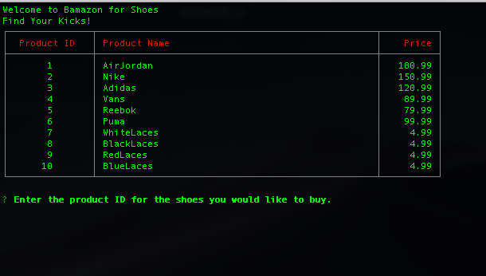
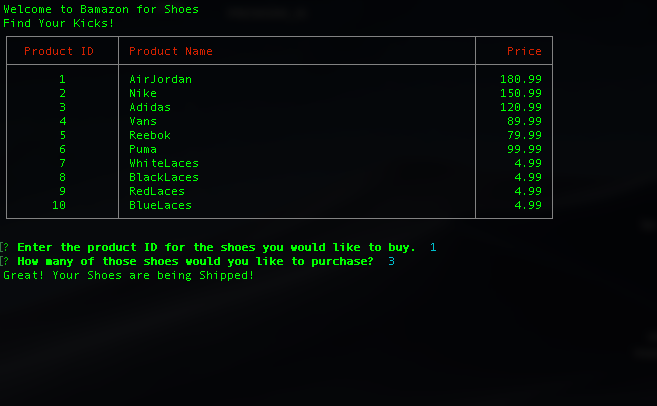
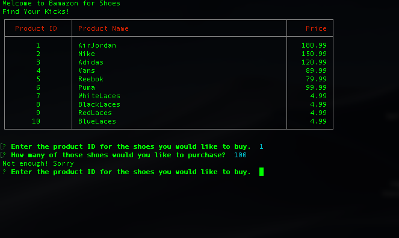

# bamazon

# About
This app is similar to amazon and lets customers see product id, product name, department id, and price but uses command line interface. Utilizing skills learned from Node and MySql. For this app to  work you must have have a MySql database client set up, then add the bamazonCUstomer.js to your terminal. Then you will run "node bamazonCutomer.js" in your terminal.

# View

The table appers:

Enter in product id and the amount you want:

If there is not sufficent stock the user will be sent back to the table to try again:

